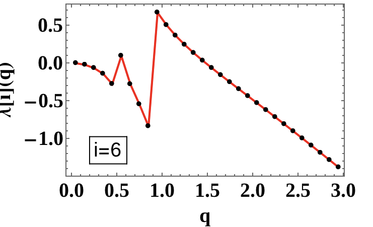
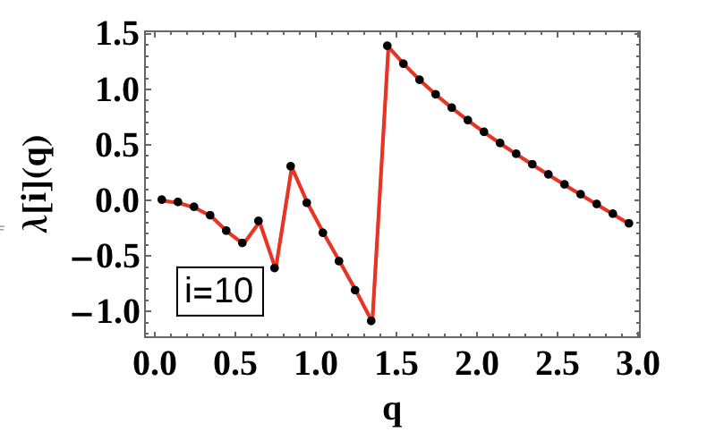
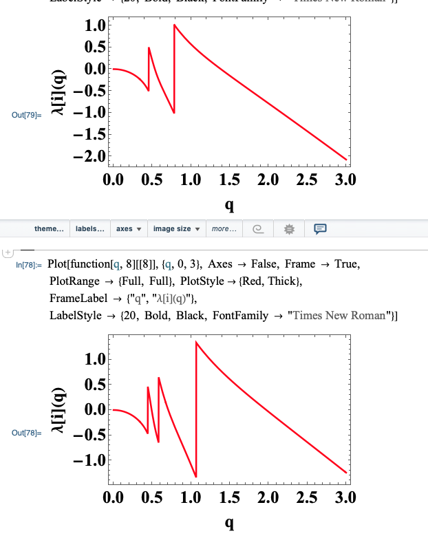
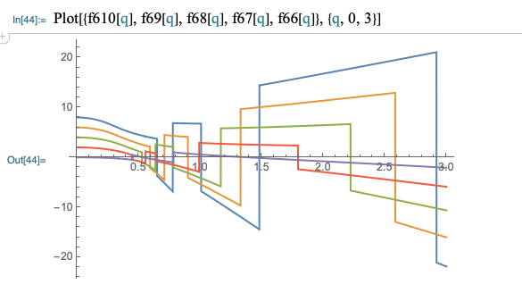

# Quadratic Hamiltonian Diagonalization
A project which aims at diagonalizing a Quadratic (Bosonic) Hamiltonian using known methods from literature.

The main goal is to obtain the energies (*excited spectra*) for the quadratic Hamiltonian (of bosonic type).

The quadratic Hamiltonian under study is of bosonic type (written in terms of bosonic creation and annihilation operators $b^\dagger$ and $b$, respectively). The harmonic term is parametrized by a real constant $\epsilon$ and the quadratic terms depend on the real parameter $v$. The actual expression of $H$ is given below:
$$H=\epsilon b^\dagger b -v(b^\dagger b^\dagger+bb)$$

Main goals of this project:

* Use the *occupation number representation* to diagonalize the Hamiltonian.
* Diagonalization of the Hamiltonian basically implies to get $H$ under a matrix form, then find its **eigenvalues** and **eigenvectors**. 
* The eigenvalues of $\mathcal{M}(H)$ will represent the possible states that the system can have.
* Since the representation is given by the bosonic number states $|0\rangle$, $|1\rangle$, ..., $|n\rangle$, with $n$ arbitrarily large, the matrix will have a size of $n\times n$. 
* This present formalism is based on a numerical approach, so there must be a truncation order $\eta$ for fixing the size of the matrix before implementing the diagonalization procedure.
* Once $\eta$ has been fixed, the bosonic states up to $|\eta\rangle$ will be used as basis for getting the *matrix elements* of $H$ (denoted by $H_{nm}$, with $n,m$ representing the actual number states).
* Having the basis ready, and knowing how the bosonic creation and annihilation operators act on these states, the procedure for finding the eigenvalues will be straightforward:

> Solving the **characteristic equation** will give the eigenvalues of $H$

$$det[\mathcal{M}(H)-\lambda I]=0$$

The set $$\Lambda=[\lambda_1,\dots,\lambda_n]$$ will be the set of eigenstates of $H$.

The eigenvectors for the solutions verify the equation:
$$\mathcal{M}x_i=\lambda_i x_i$$

Having $$\Lambda$$ for a given $H$ (parametrized in terms of $\mathcal{P}=\{\epsilon,v\})$ means that the solutions have been found and the system has defined *physical states*. Thus, problem is solved.

## Implementations

The process of diagonalization is done in:

1. Mathematica (see Wolfram Mathematica `.nb` notebooks in the project tree)
2. Python (see python scripts attached in the project tree)
3. *(?optional)* Javascript

## Graphical representation of $\lambda$ in terms of *q-ratio*

The two parameters that define the Hamiltonian are encoded into a single parameter called q-ratio ($q\equiv\frac{v}{\epsilon}$).

Every solution of the system will be a function of this ratio, so the values of $\Lambda$ will change with the change in $q$. In the images below, one can see the evolution of the 6th and 10th solutions of the system (with truncation order N=10).

___

### Solution number 6

### Solution number 10

___

## Analysis of $\lambda$ w.r.t the truncation order and index `i`

The truncation order dictates the number of solutions from the Hamiltonian problem.

### Issue with discontinuities in $\lambda$ *oscillations* with the evolution of $q$.

The *fast* change in value of $\lambda$ with a slight change of $q$ needs to be explained in terms of the actual analytic expression of that particular $lambda_i$.

### Evolution of solution $lambda_i$ with a change in truncation order N.

