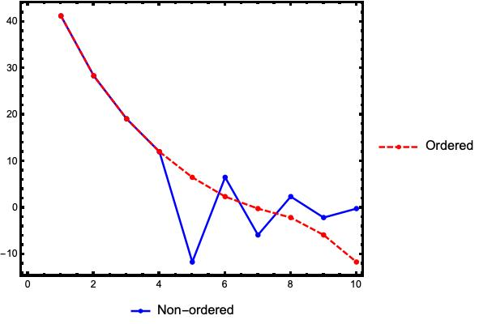
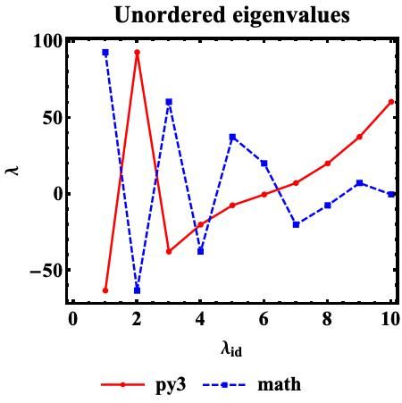
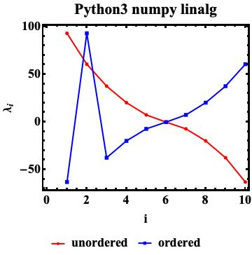

# Evolution of the eigenvalues of a bosonic Hamiltonian

___

The eigenvalues of a bosonic Hamiltonian (with quadratic terms as creation and annihilation operators) are numerically evaluated and graphically represented.

Since the Hamiltonian is parametrized in terms of a real number $q$ which plays the role of a scale factor between quadratic creation and annihilation operators, we are interested in the actual behavior of $\lambda$ with respect to $q$.

Numerically, the current problem considers an interval for $q\in[0,3]$.

## Numerical implementations

Current project is implemented in [python]() and [Mathematica](https://www.wolframcloud.com/).

Once the matrix elements of the bosonic Hamiltonian (which is represented in matrix form within current formalism) are computed for arbitrary values of $q$, the complete matrix $H$ is numerically established.

The matrix is truncated at an order $N$ that is chosen with respect to the required degree of precision. This means that the $N$ dimensional matrix will have $N$ physical solutions (assuming the $q$ parameter will produce a Hamiltonian with real elements.)

When the $N$-solutions for a given $N$ and $q$ are completely evaluated, it is possible to select one eigenvalue $\lambda_i$ (the *i-th* solution) and see how does it behave when $q$ changes, accordingly to the mentioned interval.

### $\lambda$ study

We are interested into the actual behavior of a *fixed index* solution $lambda_i$ with respect to a change in $q$. Since for every $N$, there are exactly $N$ solutions to $H$, one should analyze the behavior of $lambda_i$ to $q\in[0,3]$.

### Convention

Both implementations are fixed to work with **decreasingly ordered** eigenvalues. Since python's numerical approach (current formalism uses `numpy`'s `linalg` module for finding the eigenvalues of a real matrix) gives the lambdas in a *no-particular order*, which is also different than the `Mathematica`'s `Eigenvalues` implementation.

Example for mentioned behavior can be seen below, where the first 10 real solutions for $H_{10}$ (evaluated at a fixed $q=1.0$) are evaluated.

PY3:

```
-11.64959234940708, -5.8343154548080784, -2.098776649885983, -0.17018844374872244, 2.409780909343013, 6.554016220947683, 12.04778159649449, 19.129175394578915, 28.361921426914197, 41.25019734957153
```

Mathematica:

```
41.2502, 28.3619, 19.1292, 12.0478, -11.6496, 6.55402, -5.83432, 2.40978, -2.09878, -0.170188
```

Due to this difference in the solution ordering, a consistent approach is required; as a result, the lambdas are evaluated and stored in decreasing order.



The plot shown above describes how the difference in the lambda-ordering is taking place within Mathematica's implementation.

Both algorithms (`py3` and `math`) behave inherently different within their way of finding the eigenvalues (and, if necessary, the eigenvectors). This can be seen in the figure below, where default lists of $\lambda$ for a given $N$ and $q$ (e.g. $N=10$ and $q=3$).



Furthermore, lambda evaluation made by python's numerical implementation: `linalg` is also producing inconsistencies in the output of such values with respect to a fixed $q$ parameter. This behavior can be seen in the figure below.

